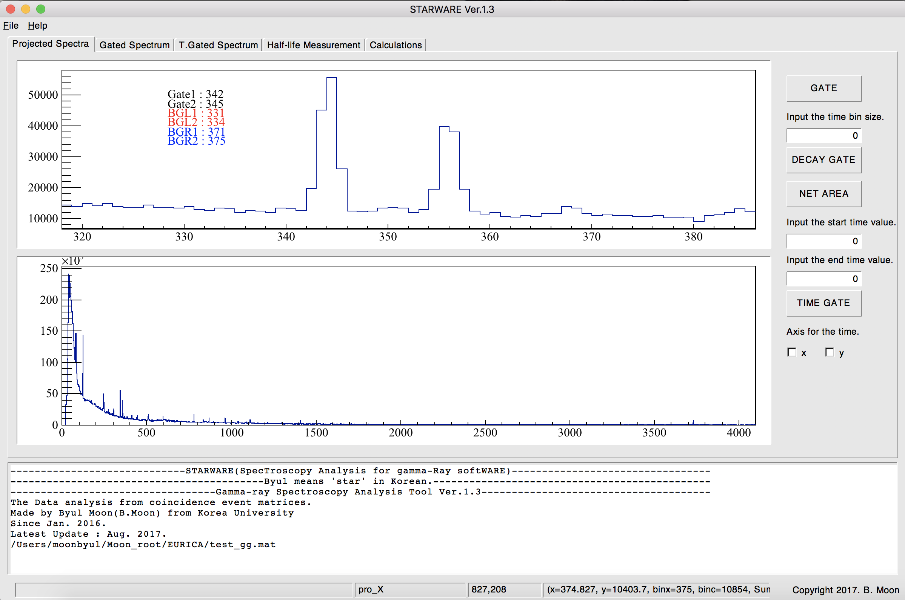

# STARWARE

STARWARE(SpecTroscopy Analysis for gamma-Ray softWARE) is an analysis tool dedicated for gamma-ray spectroscopy based on ROOT.

This program operates with a GUI system.

## Manual
The online manual is available at https://github.com/mb0316/starware/wiki.

## Update News
Since Jan. 2016.

Current Version : ver.2.0

Last Update : 8.Feb.2018.

By Byul Moon from Korea University

ver.2.0 (8. Feb. 2018)
1. A pop-up window will ask you to set the bin size of your 2-D histogram only for data files with mat stype.
2. Able to measure the half-life of isomeric state.
3. Able to set the fit range by using a GUI scroll bar.
4. Calculations has been removed from STARWARE but these functions will be included in STARCAL program which is being developing.
